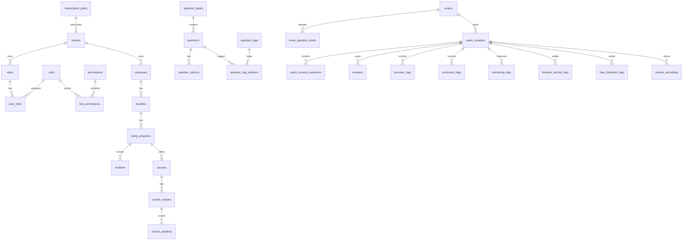

# ERD

```mermaid
erDiagram
  tenants ||--o{ users : owns
  tenants ||--o{ campuses : owns
  subscription_plans ||--o{ tenants : subscribes
  users ||--o{ user_roles : has
  roles ||--o{ user_roles : assigned
  roles ||--o{ role_permissions : grants
  permissions ||--o{ role_permissions : included
  campuses ||--o{ faculties : has
  faculties ||--o{ study_programs : has
  study_programs ||--o{ students : enrolls
  study_programs ||--o{ courses : offers
  courses ||--o{ course_classes : has
  course_classes ||--o{ course_students : enrolls
  question_banks ||--o{ questions : contains
  questions ||--o{ question_options : has
  questions ||--o{ question_tag_relations : tagged
  question_tags ||--o{ question_tag_relations : maps
  exams ||--o{ exam_question_pools : samples
  exams ||--o{ exam_sessions : starts
  exam_sessions ||--o{ exam_session_questions : renders
  exam_sessions ||--o{ answers : saves
  exam_sessions ||--o{ recovery_logs : records
  exam_sessions ||--o{ reconnect_logs : records
  exam_sessions ||--o{ proctoring_logs : observes
  exam_sessions ||--o{ browser_activity_logs : audits
  exam_sessions ||--o{ face_detection_logs : audits
  exam_sessions ||--o{ screen_recordings : stores
```
