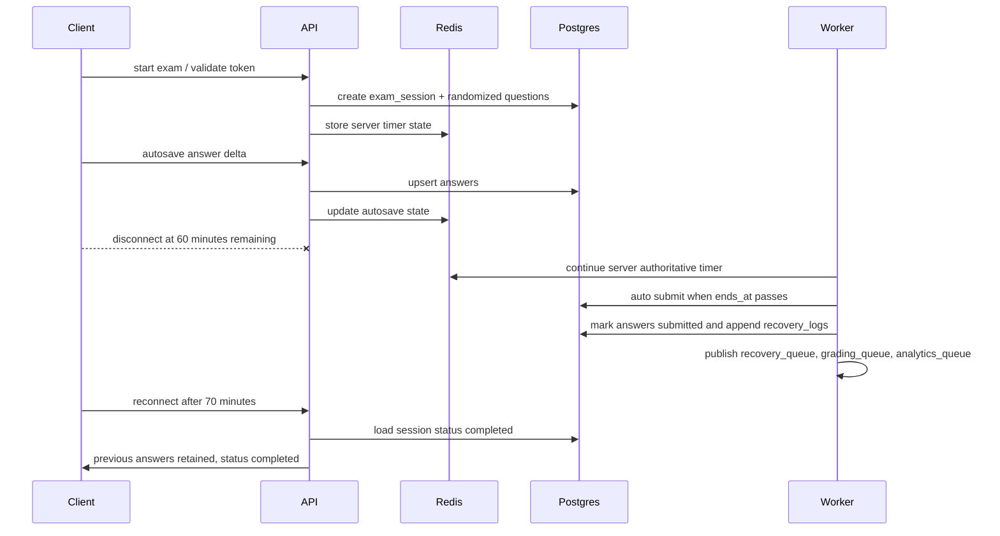

# Recovery Flow

```mermaid
sequenceDiagram
  participant Client
  participant API
  participant Redis
  participant Postgres
  participant Worker
  Client->>API: start exam / validate token
  API->>Postgres: create exam_session + randomized questions
  API->>Redis: store server timer state
  Client->>API: autosave answer delta
  API->>Postgres: upsert answers
  API->>Redis: update autosave state
  Client--xAPI: disconnect at 60 minutes remaining
  Worker->>Redis: continue server authoritative timer
  Worker->>Postgres: auto submit when ends_at passes
  Worker->>Postgres: mark answers submitted and append recovery_logs
  Worker->>Worker: publish recovery_queue, grading_queue, analytics_queue
  Client->>API: reconnect after 70 minutes
  API->>Postgres: load session status completed
  API->>Client: previous answers retained, status completed
```
